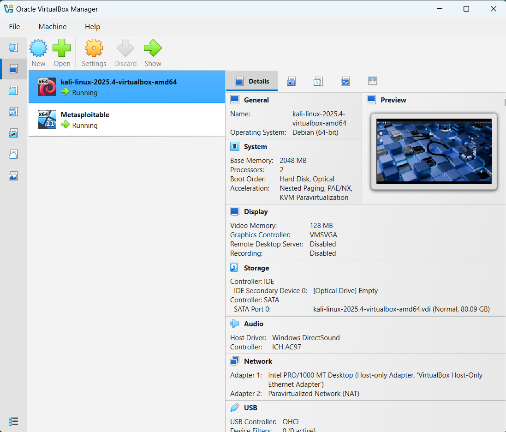
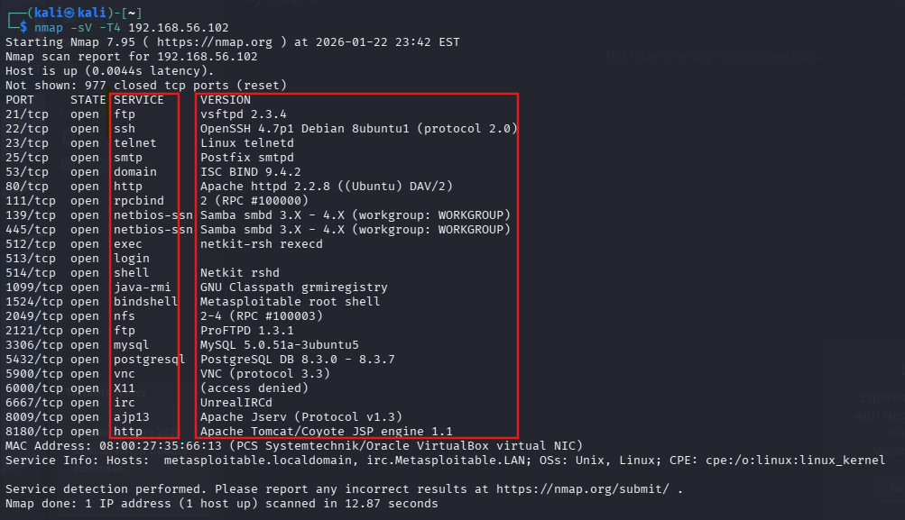

# Hi, I'm Patrick O'Hara 👋 
### CompTIA Security+ Certified | Aspiring Cybersecurity Professional

I am a career changer transitioning into the cybersecurity field with a focus on **Security Operations (SOC)** and **Vulnerability Management**. I am passionate about hands-on labbing, network defense, and understanding the "why" behind security threats.

---

### 🛡️ Certifications
* **CompTIA Security+ (SY0-701)** - [Verify Here](https://www.credly.com/badges/b8dccca7-f2b0-41a0-b271-e3ef95204309/public_url)
* **Google Cybersecurity Professional Certificate V2** - [Verify Here](https://www.credly.com/badges/0e2a88d1-8767-40b0-9b32-19bd84ea966/public_url)

---

### 🛠️ Technical Skills
* **Security Tools:** Nmap, Nessus, Wireshark, Kali Linux
* **Networking:** TCP/IP, DNS, FTP/SSH Analysis, Network Segmentation
* **OS:** Linux (CLI), Windows, VirtualBox/VMware

---

## 🚀 Hands-On Lab Projects

### 0. Lab Infrastructure & Virtualization
To facilitate safe security testing, I engineered an isolated virtual network consisting of an attacking machine (Kali Linux) and a vulnerable target (Metasploitable 2).

  
  
<i><b>Infrastructure Overview:</b> Managing an isolated virtual environment using Oracle VirtualBox to simulate enterprise network attacks and defenses.</i>

---

### 1. Network Vulnerability Assessment (Nmap)
I utilized Nmap for active reconnaissance and service version detection to identify legacy protocol vulnerabilities.

  
  
<i>Analysis of open ports and service versions to identify potential attack vectors and unencrypted protocols.</i>

---

### 2. Enterprise Vulnerability Management (Nessus)
I deployed Nessus Essentials to automate threat detection, prioritizing remediation based on CVSS severity scores.

  
  
<i><b>Vulnerability Distribution:</b> Prioritizing remediation efforts by categorizing system weaknesses according to CVSS severity.</i>

 

  
  
<i><b>Detailed Findings:</b> Reviewing technical "Proof of Concept" data and vendor-recommended remediation steps for critical risks.</i>

---

### 3. Traffic Forensics & Protocol Auditing (Wireshark)
I performed Deep Packet Inspection (DPI) to demonstrate the risks of unencrypted traffic and credential theft.

  
  
<i>Evidence of cleartext credential transmission, demonstrating the risk of Man-in-the-Middle (MITM) attacks.</i>

---

### 🔗 Connect with Me
[LinkedIn](https://linkedin.com/in/patrick-o-hara25) | [Email Me](mailto:PatOksu02@gmail.com)
